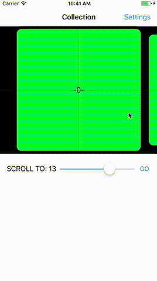

# STWCollectionView


[](https://developer.apple.com/iphone/index.action)
[](https://developer.apple.com/swift)
[](http://mit-license.org)

STWCollectionView is an UICollectionView sublcass easy to create and manage for a collection with carousel effect and is very simple to customize.
You can set how many cells are visible simultaneously or give a fixed size to cells, and the collection will set automatically the simultaneously visible cells.
You can set the space between the cells and the vertical and horizontal padding than you can see a bit of the adjacent cells.
Further, STWCollectionView has a delegate to better manage cells during the scrolling phase such as: the cell's currently visible indexPaths and their percentage of positioning based on the center.

<kbd>

</kbd>

## Installation

#### CocoaPods
```
pod 'STWCollectionView'
```

#### Manually
Add `STWCollectionView.swift` and  `STWCollectionViewFlowLayout.swift` file to your project.


## Usage

Set as you would an `UICollectionView`

```swift
let stwCollectionView = STWCollectionView()

override func viewDidLoad() {
  super.viewDidLoad()

  // delegate & data source
  stwCollectionView.delegate = self
  stwCollectionView.dataSource = self

  // layout subviews
  ...

  // register collection cells
  stwCollectionView.register(UICollectionViewCell.self, forCellWithReuseIdentifier: cellIdentifier)

}

// datasource extensions
...

```

## Delegation

In addition to the `UICollectionViewDelegate` methods, `STWCollectionView` has three other methods to manage scrolling thanks to `STWCollectionViewDelegate` that is a `UICollectionViewDelegate` protocol subclass

```swift
extension ViewController: STWCollectionViewDelegate {

func collectionView(_ collectionView: UICollectionView, didSelectItemAt indexPath: IndexPath) {
		// Scroll to selected cell
        stwCollectionView.scrollTo(indexPath: indexPath, animated: true)
    }
    
    func collectionViewDidEndDeceleratingWithPercentages(_ collectionView: STWCollectionView, visibleIndexPaths indexPaths: [IndexPath], percentageVisibleIndexPaths percentages: [CGFloat]) {
        print("indexPaths after Decelerating: \(indexPaths)")
        print("percentages after Decelerating: \(percentages)")
    }
    
    func collectionViewDidEndScrollingAnimationWithPercentages(_ collectionView: STWCollectionView, visibleIndexPaths indexPaths: [IndexPath], percentageVisibleIndexPaths percentages: [CGFloat]) {
        print("indexPaths after Scrolling Animation: \(indexPaths)")
        print("percentages after Scrolling Animation: \(percentages)")
    }
    
    func collectionViewDidScrollWithPercentages(_ collectionView: STWCollectionView, visibleIndexPaths indexPaths: [IndexPath], percentageVisibleIndexPaths percentages: [CGFloat]) {
        print("indexPaths during Scrolling: \(indexPaths)")
        print("percentages during Scrolling: \(percentages)")        
    }
}

```


## Customize

You can customize `STWCollectionView` for all your needs

**STWCollectionView setting properties**:

* **`verticalPadding`** Distance of cells form top and bottom border.
**❕ Disabled if the STWCollectionView is in horizontal and has a fixedCellSize**

  ```swift
  var verticalPadding: CGFloat { get set }
  // default: 20
  ```

* **`horizontalPadding`** Distance of cells form left and right border.
**❕ Disabled if the STWCollectionView is in vertical and has a fixedCellSize**

  ```swift
  var horizontalPadding: CGFloat { get set }
  // default: 20
  ```

* **`itemSpacing`** Distance beetween cells.

  ```swift
  var itemSpacing: CGFloat { get set }
  // default: 20
  ```

* **`fixedCellsNumber`** Numbers of simultaneous visible cells.
**❕ Sets fixedCellSize to nil when is setted**

  ```swift
  var fixedCellsNumber: Int { get set }
  // default: 1

  ```
  
* **`fixedCellSize`** Fixed size of cells.
**❕ Automatically calculates fixedCellsNumber when is setted**

  ```swift
  var fixedCellSize: CGSize? { get set }

  ```

* **`direction`** Direction of scrolling.
**(supports vertical)**

  ```swift
  var direction: UICollectionViewScrollDirection { get set }
  // default: .horizontal
 
  ```
  
**STWCollectionView getting properties**:

* **`currentVisibleIndexPaths`** Current visible items' indexPaths.

  ```swift
  var currentVisibleIndexPaths: [IndexPath] { get }

  ```
  
* **`currentPage`** Current Index in center.
**❕ if fixedCellsNumber are even the result is a CGFloat beetween two value**

  ```swift
  var currentPage: CGFloat { get }

  ```
  
**STWCollectionView public methods**:

* **`scrollTo(indexPath: animated:)`** Scrolls STWCollectionView at specific indexPath.

  ```swift
  func scrollTo(indexPath:IndexPath, animated:Bool)

  ```
  
## Requirements
This pod requires a deployment target of iOS 9.0 or greater

## Author

[@Steewitter](https://twitter.com/Steewitter), me@steewe.com

## License

STWCollectionView is available under the MIT license. See the LICENSE file for more info.
